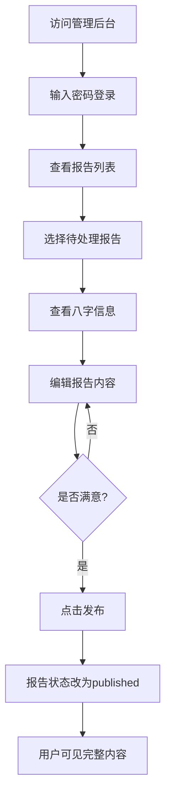

# 八字命理分析平台 - 产品需求文档 (PRD)

**文档版本**: v1.0 - 方案A（MVP版本）
**编写日期**: 2025-01-08
**产品状态**: 开发中（60%完成）
**目标用户**: 命理爱好者、专业命理师

---

## 📋 目录

1. [产品概述](#1-产品概述)
2. [核心功能模块](#2-核心功能模块)
3. [技术架构](#3-技术架构)
4. [数据模型](#4-数据模型)
5. [业务流程](#5-业务流程)
6. [功能详细说明](#6-功能详细说明)
7. [已实现功能清单](#7-已实现功能清单)
8. [待实现功能清单](#8-待实现功能清单)
9. [非功能性需求](#9-非功能性需求)
10. [未来扩展方向](#10-未来扩展方向)

---

## 1. 产品概述

### 1.1 产品定位

八字命理分析平台是一款基于传统命理学的现代化Web应用，通过自动化八字计算和报告生成，为用户提供个性化的命理分析服务。

### 1.2 产品价值

**用户价值：**
- ✅ 快速获取准确的八字信息（支持真太阳时计算）
- ✅ 获得专业的8页完整命理分析报告
- ✅ 随时查看自己的报告内容

**管理员价值：**
- ✅ 自动生成报告初稿，节省人工计算时间
- ✅ 统一的报告管理后台
- ✅ 可编辑和发布报告

### 1.3 产品目标

**短期目标（当前版本）：**
- 实现核心的八字计算功能
- 自动生成报告模板
- 提供简单的管理后台

**长期目标（未来版本）：**
- 支持用户登录和多用户管理
- 实现券码付费系统
- 移动端完整适配
- AI辅助报告生成

### 1.4 目标用户画像

| 用户类型 | 特征 | 需求 |
|---------|------|------|
| **普通用户** | 对命理感兴趣，希望了解自己八字 | 快速、准确的八字计算；易懂的分析报告 |
| **管理员** | 专业命理师，负责审核和完善报告 | 高效的报告管理；完整的八字信息展示 |

---

## 2. 核心功能模块

### 2.1 功能架构图

```
八字命理分析平台
├── 用户端
│   ├── 首页（产品介绍）
│   ├── 计算器页面（输入出生信息）
│   └── 报告查看页面（查看分析结果）
│
└── 管理端
    ├── 管理员登录
    ├── 报告列表页面
    └── 报告编辑器
```

### 2.2 模块关系图

```
用户输入信息
    ↓
八字计算引擎（真太阳时）
    ↓
报告生成引擎（8页模板）
    ↓
保存到数据库（草稿状态）
    ↓
管理员编辑审核
    ↓
发布报告
    ↓
用户查看完整内容
```

---

## 3. 技术架构

### 3.1 技术栈

| 层次 | 技术 | 版本 | 说明 |
|------|------|------|------|
| **前端框架** | Next.js | 16.0.1 | React框架，支持SSR和App Router |
| **开发语言** | TypeScript | 最新 | 类型安全 |
| **样式方案** | TailwindCSS | 4.x | 实用优先的CSS框架 |
| **数据库** | SQLite | - | 轻量级关系型数据库 |
| **ORM** | Prisma | 6.19.0 | 现代化数据库工具 |
| **八字计算** | lunar-javascript | 最新 | 农历公历转换、八字排盘 |
| **Markdown渲染** | react-markdown | 最新 | 报告内容渲染 |
| **密码加密** | bcryptjs | 最新 | 用户密码加密（预留） |

### 3.2 项目目录结构

```
bazi-life-mvp/
├── app/                          # Next.js App Router
│   ├── page.tsx                 # 首页
│   ├── calc/page.tsx            # 计算器页面
│   ├── reports/[id]/page.tsx   # 报告查看页面
│   ├── admin/                   # 管理后台
│   │   ├── page.tsx            # 报告列表
│   │   └── reports/[id]/page.tsx  # 报告编辑器
│   ├── api/                     # API路由
│   │   └── reports/            # 报告相关API
│   ├── globals.css             # 全局样式
│   └── layout.tsx              # 根布局
├── lib/                         # 工具函数库
│   ├── bazi.ts                 # 八字计算工具
│   ├── report-generator.ts     # 报告生成工具
│   ├── cities.ts               # 城市查询工具
│   └── prisma.ts               # Prisma客户端
├── data/                        # 数据文件
│   └── cities.json             # 城市经纬度数据
├── prisma/                      # 数据库相关
│   ├── schema.prisma           # 数据模型定义
│   └── seed.ts                 # 数据库种子
├── .env                         # 环境变量
├── package.json                # 项目配置
├── IMPLEMENTATION_PLAN.md      # 实施计划
├── CONTINUE_GUIDE.md           # 继续实施指南
└── PRD_CURRENT_VERSION.md      # 本文档
```

---

## 4. 数据模型

### 4.1 ER图

```
┌─────────────┐         ┌──────────────┐         ┌─────────────┐
│    User     │1      * │    Report    │1      1 │   Voucher   │
│             │─────────│              │─────────│             │
│ - id        │         │ - id         │         │ - id        │
│ - phone     │         │ - userId     │         │ - code      │
│ - password  │         │ - name       │         │ - reportId  │
└─────────────┘         │ - gender     │         └─────────────┘
                        │ - birthDate  │
                        │ - baziYear   │
                        │ - baziMonth  │
                        │ - baziDay    │
                        │ - baziHour   │
                        │ - fullContent│
                        └──────────────┘
```

### 4.2 数据表详细说明

#### 4.2.1 User 表（用户表）

| 字段名 | 类型 | 约束 | 说明 |
|-------|------|------|------|
| id | String | PRIMARY KEY | 用户唯一标识（CUID） |
| phone | String | UNIQUE | 手机号码 |
| password | String | NOT NULL | 加密后的密码 |
| createdAt | DateTime | DEFAULT now() | 创建时间 |
| updatedAt | DateTime | AUTO UPDATE | 更新时间 |

**业务规则：**
- 手机号必须唯一
- 密码使用 bcrypt 加密存储
- 预留字段，方案A中暂不使用

#### 4.2.2 Voucher 表（券码表）

| 字段名 | 类型 | 约束 | 说明 |
|-------|------|------|------|
| id | String | PRIMARY KEY | 券码唯一标识 |
| code | String | UNIQUE | 30字符随机券码 |
| isUsed | Boolean | DEFAULT false | 是否已使用 |
| createdAt | DateTime | DEFAULT now() | 创建时间 |
| usedAt | DateTime | NULLABLE | 使用时间 |
| reportId | String | UNIQUE, NULLABLE | 关联的报告ID |

**业务规则：**
- 券码长度固定30字符
- 一个券码只能绑定一个报告
- 使用后记录 usedAt 时间
- 预留字段，方案A中暂不使用

#### 4.2.3 Report 表（报告表）⭐ 核心表

| 字段名 | 类型 | 约束 | 说明 |
|-------|------|------|------|
| **基础字段** |
| id | String | PRIMARY KEY | 报告唯一标识 |
| createdAt | DateTime | DEFAULT now() | 创建时间 |
| updatedAt | DateTime | AUTO UPDATE | 更新时间 |
| status | String | DEFAULT "draft" | 状态：draft/published |
| **用户关联** |
| userId | String | NULLABLE | 关联用户ID（方案A中为空） |
| **基本信息** |
| name | String | NOT NULL | 用户姓名 |
| gender | String | NOT NULL | 性别：male/female |
| birthDate | String | NOT NULL | 出生日期 YYYY-MM-DD |
| birthTime | String | NOT NULL | 出生时间 HH:mm |
| country | String | DEFAULT "中国" | 国家 |
| city | String | DEFAULT "" | 出生城市 |
| longitude | Float | NULLABLE | 经度（用于真太阳时） |
| latitude | Float | NULLABLE | 纬度（用于真太阳时） |
| **八字信息** |
| baziYear | String | DEFAULT "" | 年柱（如：甲子） |
| baziMonth | String | DEFAULT "" | 月柱 |
| baziDay | String | DEFAULT "" | 日柱 |
| baziHour | String | DEFAULT "" | 时柱 |
| trueSolarTime | String | DEFAULT "" | 真太阳时 HH:mm |
| wuxing | String | DEFAULT "" | 五行分析（JSON字符串） |
| **报告内容** |
| title | String | NOT NULL | 报告标题 |
| basicSummary | String | DEFAULT "" | 基础摘要 |
| fullContent | String | DEFAULT "" | 完整内容（Markdown） |
| publishAt | DateTime | NULLABLE | 发布时间 |
| **兼容字段** |
| formJson | String | DEFAULT "{}" | 原始表单数据（JSON） |

**状态说明：**
- `draft`: 草稿状态，用户看到"分析中"提示
- `published`: 已发布，用户可查看完整内容

**wuxing字段JSON格式：**
```json
{
  "wood": 25,        // 木 百分比
  "fire": 12,        // 火 百分比
  "earth": 25,       // 土 百分比
  "metal": 13,       // 金 百分比
  "water": 25,       // 水 百分比
  "dominant": "木",  // 主导元素
  "weak": "火"       // 弱势元素
}
```

---

## 5. 业务流程

### 5.1 用户使用流程

```mermaid
graph TD
    A[访问首页] --> B[点击开始测算]
    B --> C[填写出生信息]
    C --> D{输入城市名称}
    D --> E[选择城市<br/>自动填充经纬度]
    E --> F[提交表单]
    F --> G[后端计算八字]
    G --> H[生成报告初稿]
    H --> I[创建草稿报告]
    I --> J[跳转到报告页面]
    J --> K{报告状态?}
    K -->|draft| L[显示"分析中"状态]
    K -->|published| M[显示完整报告]
```

### 5.2 管理员工作流程



### 5.3 八字计算流程


---

## 6. 功能详细说明

### 6.1 用户端功能

#### 6.1.1 首页

**页面路径**: `/`

**功能描述**:
- 展示产品介绍
- 引导用户开始测算

**UI元素**:
- 产品标题："八字命理分析"
- 介绍文案："通过传统命理学，探索您的人生轨迹与命运密码"
- CTA按钮："开始测算"（跳转到 `/calc`）

**状态**: ✅ 已实现

---

#### 6.1.2 计算器页面

**页面路径**: `/calc`

**功能描述**:
用户输入出生信息，系统自动计算八字并生成报告。

**表单字段**:

| 字段名 | 类型 | 必填 | 验证规则 | 说明 |
|-------|------|------|---------|------|
| 姓名 | text | ✅ | 长度1-20字符 | 用于报告标题 |
| 性别 | select | ✅ | male/female | 影响报告内容 |
| 出生日期 | date | ✅ | 1900-01-01至今 | 用于八字计算 |
| 出生时间 | time | ✅ | HH:mm格式 | 用于时柱计算 |
| 出生城市 | autocomplete | ✅ | 从城市列表选择 | 用于真太阳时 |

**城市自动补全功能**:
- 输入城市名称（支持拼音）
- 实时显示匹配结果（最多5个）
- 选择后自动填充经纬度
- 显示提示："已选择：北京（将使用真太阳时计算）"

**交互流程**:
1. 用户填写所有必填字段
2. 点击"开始测算"按钮
3. 前端验证表单
4. 发送POST请求到 `/api/reports`
5. 显示加载状态："测算中..."
6. 成功后跳转到 `/reports/[id]`

**错误处理**:
- 字段为空：显示"请填写XXX"
- 城市未选择：显示"请从列表中选择城市"
- API失败：显示"创建报告失败，请重试"

**状态**: ⏳ 待实现（有完整代码参考）

---

#### 6.1.3 报告查看页面

**页面路径**: `/reports/[id]`

**功能描述**:
展示用户的八字分析报告，根据状态显示不同内容。

**草稿状态（draft）UI**:
```
┌────────────────────────────┐
│     📄 正在分析中           │
│                            │
│  专业人员正在为您分析       │
│  八字命理，请耐心等待       │
│                            │
│  报告编号: BXZ-xxx         │
│  创建时间: 2025-01-08      │
│  状态: [分析中]            │
└────────────────────────────┘
```

**已发布状态（published）UI**:
```
┌────────────────────────────────────┐
│  张三的八字命理分析报告  [已完成]   │
│  发布时间: 2025-01-08              │
├────────────────────────────────────┤
│  基础摘要（蓝色背景区域）           │
│  您的八字为：甲子 乙丑 丙寅 丁卯   │
├────────────────────────────────────┤
│  详细分析（Markdown渲染）          │
│  # 第1页：命盘总览               │
│  # 第2页：性格倾向               │
│  ...                              │
└────────────────────────────────────┘
```

**报告内容结构**（8页）:
1. 📄 第1页：命盘总览与五行特征
2. 🌸 第2页：性格倾向与内在动力
3. 🔥 第3页：事业与行动力
4. 💰 第4页：财富与资源流动
5. 💞 第5页：感情与人际模式
6. 🌿 第6页：健康与生活节奏
7. 🌏 第7页：大运与流年趋势
8. 🌠 第8页：总结与行动建议

**状态**: ✅ 已实现（需更新以支持新字段）

---

### 6.2 管理端功能

#### 6.2.1 管理员登录

**页面路径**: `/admin` 和 `/admin/reports/[id]`

**功能描述**:
密码保护的管理后台入口。

**认证方式**:
- 简单密码验证（环境变量配置）
- Session存储（sessionStorage）
- 默认密码：`admin123`

**UI交互**:
```
┌─────────────────────┐
│  管理员登录          │
│  请输入管理员密码    │
│                     │
│  [密码输入框]       │
│  [登录按钮]         │
└─────────────────────┘
```

**安全说明**:
⚠️ 当前版本为MVP，使用简单密码验证。生产环境建议：
- 使用后端API验证
- 添加JWT Token
- 添加CSRF保护
- 密码复杂度要求

**状态**: ✅ 已实现

---

#### 6.2.2 报告列表页面

**页面路径**: `/admin`

**功能描述**:
展示所有报告的列表，方便管理员查看和编辑。

**统计面板**:
```
┌──────────┐ ┌──────────┐ ┌──────────┐
│ 总报告数  │ │ 已发布    │ │ 草稿     │
│   10     │ │    3     │ │    7     │
└──────────┘ └──────────┘ └──────────┘
```

**列表表格字段**:

| 列名 | 显示内容 | 说明 |
|------|---------|------|
| 姓名 | report.name | 用户姓名 |
| 性别 | 男/女 | 转换显示 |
| 出生日期 | YYYY-MM-DD | 格式化显示 |
| 城市 | report.city | 出生城市 |
| 八字 | 年柱 月柱<br/>日柱 时柱 | 双行显示 |
| 状态 | 已发布/草稿 | 带颜色标签 |
| 创建时间 | 本地化日期 | zh-CN格式 |
| 操作 | 编辑链接 | 跳转到编辑器 |

**表格样式**:
- 鼠标悬停高亮行
- 状态徽章：绿色（已发布）/ 黄色（草稿）
- 八字使用等宽字体（font-mono）

**状态**: ⏳ 待实现（有完整代码参考）

---

#### 6.2.3 报告编辑器

**页面路径**: `/admin/reports/[id]`

**功能描述**:
编辑和发布报告内容。

**页面布局**:
```
┌────────────────────────────────────┐
│  编辑报告              [已发布/草稿] │
├────────────────────────────────────┤
│  八字信息卡片（蓝色背景）            │
│  姓名: 张三  性别: 男               │
│  出生: 1990-01-01 12:00            │
│  城市: 北京  真太阳时: 12:15       │
│  ┌──────┬──────┬──────┬──────┐   │
│  │年柱  │月柱  │日柱  │时柱  │   │
│  │甲子  │乙丑  │丙寅  │丁卯  │   │
│  └──────┴──────┴──────┴──────┘   │
├────────────────────────────────────┤
│  [标题输入框]                      │
│  [基础摘要文本域]                  │
│  [完整内容文本域]（Markdown）      │
├────────────────────────────────────┤
│  创建时间 | 更新时间                │
├────────────────────────────────────┤
│  [保存修改] [发布报告]              │
└────────────────────────────────────┘
```

**可编辑字段**:
- ✏️ 报告标题
- ✏️ 基础摘要
- ✏️ 完整内容（支持Markdown）

**只读字段**（新增显示）:
- 👁️ 姓名、性别
- 👁️ 出生日期、出生时间
- 👁️ 出生城市
- 👁️ 真太阳时
- 👁️ 四柱八字

**操作按钮**:

| 按钮 | 功能 | 状态条件 | API |
|-----|------|---------|-----|
| 保存修改 | 保存当前编辑内容 | 任何时候 | PATCH /api/reports/[id] |
| 发布报告 | 发布并设置publishAt | 仅草稿时显示 | PATCH /api/reports/[id] |

**保存逻辑**:
```typescript
{
  title: string,
  basicSummary: string,
  fullContent: string,
  status: 'draft' | 'published',
  publishAt: DateTime | null
}
```

**状态**: ✅ 已实现（需添加八字信息显示）

---

## 7. 已实现功能清单

### 7.1 核心工具库 ✅

#### 7.1.1 八字计算工具 `/lib/bazi.ts`

**功能**:
- ✅ 支持公历转农历
- ✅ 计算年月日时四柱
- ✅ 真太阳时修正（基于经纬度）
- ✅ 五行统计分析
- ✅ 纳音计算

**API**:
```typescript
interface BaziInfo {
  year: string;      // 年柱
  month: string;     // 月柱
  day: string;       // 日柱
  hour: string;      // 时柱
  yearGan: string;   // 年干
  yearZhi: string;   // 年支
  // ... 更多字段
  naYin: {...};      // 纳音
  wuxing: WuxingAnalysis;  // 五行分析
  trueSolarTime?: string;  // 真太阳时
}

calculateBazi(
  birthDate: string,    // YYYY-MM-DD
  birthTime: string,    // HH:mm
  longitude?: number,   // 经度
  latitude?: number     // 纬度
): BaziInfo
```

**真太阳时算法**:
```typescript
// 经度每15度差1小时，东八区标准经度为120度
timeOffset = (longitude - 120) / 15
真太阳时 = 当地时间 + timeOffset
```

---

#### 7.1.2 报告生成工具 `/lib/report-generator.ts`

**功能**:
- ✅ 根据模板生成8页完整报告
- ✅ Markdown格式输出
- ✅ 个性化内容（基于八字分析）

**API**:
```typescript
interface ReportData {
  reportId: string;
  name: string;
  gender: '男' | '女';
  birthDate: string;
  birthTime: string;
  location: string;
  bazi: BaziInfo;
}

generateFullReport(data: ReportData): string  // 返回Markdown
```

**报告模板变量**:
```typescript
{
  // 基本信息
  report_id, name, gender, birth_date, birth_time, location,

  // 八字信息
  year_gz, month_gz, day_gz, hour_gz,

  // 五行百分比
  wood, fire, earth, metal, water,

  // 分析结果
  element_dominant,      // 主导元素
  element_symbolism,     // 元素象征
  element_weak,          // 弱势元素
  element_weak_area,     // 薄弱领域
  balance_action,        // 平衡建议

  // 性格分析
  trait_1, trait_2, appearance_behavior, inner_emotion,

  // 事业分析
  action_trait, career_energy_pattern, industry_suggestions,

  // 财富分析
  money_attitude, wealth_tendency_context, wealth_risk_behavior,

  // 感情分析
  love_trait_1, love_trait_2, love_expression_style,

  // 健康建议
  health_element_weak, health_suggestion_area,

  // 流年分析
  decade_start, decade_end, decade_keyword, year_theme,

  // 总结
  keyword_1, keyword_2, keyword_3, life_theme, insight_phrase
}
```

---

#### 7.1.3 城市查询工具 `/lib/cities.ts` + `/data/cities.json`

**功能**:
- ✅ 支持城市名称搜索
- ✅ 支持拼音搜索
- ✅ 返回经纬度信息
- ✅ 40个主要城市数据

**API**:
```typescript
interface City {
  name: string;        // 城市名称
  pinyin: string;      // 拼音
  province: string;    // 省份
  longitude: number;   // 经度
  latitude: number;    // 纬度
}

// 搜索城市（模糊匹配）
searchCities(query: string, limit?: number): City[]

// 查找城市（精确匹配）
findCity(query: string): City | null

// 获取所有城市
getAllCities(): City[]

// 获取省份列表
getProvinces(): string[]

// 按省份获取城市
getCitiesByProvince(province: string): City[]
```

**城市数据示例**:
```json
{
  "name": "北京",
  "pinyin": "beijing",
  "province": "北京",
  "longitude": 116.4074,
  "latitude": 39.9042
}
```

**覆盖城市**:
北京、上海、广州、深圳、成都、杭州、重庆、武汉、西安、天津、南京、苏州、长沙、郑州、沈阳、青岛、大连、济南、哈尔滨、福州、厦门、昆明、南宁、太原、长春、石家庄、南昌、贵阳、兰州、海口、银川、西宁、呼和浩特、乌鲁木齐、拉萨、合肥、宁波、温州、东莞、佛山

---

### 7.2 数据库设计 ✅

**已完成**:
- ✅ User 表定义
- ✅ Voucher 表定义
- ✅ Report 表定义
- ✅ 关系定义（一对多、一对一）

**Schema文件**: `prisma/schema.prisma`

**数据库状态**: 已推送到 SQLite（dev.db）

---

### 7.3 前端页面 ✅

| 页面 | 路径 | 状态 |
|------|------|------|
| 首页 | `/` | ✅ 已实现 |
| 计算器（旧版） | `/calc` | ✅ 已实现（需更新） |
| 报告查看 | `/reports/[id]` | ✅ 已实现 |
| 管理员登录 | `/admin` | ⏳ 需创建列表页 |
| 报告编辑器 | `/admin/reports/[id]` | ✅ 已实现（需添加八字显示） |
| 开发测试页 | `/dev` | ✅ 已实现 |

---

### 7.4 API接口 ✅

| 方法 | 路径 | 功能 | 状态 |
|------|------|------|------|
| GET | `/api/reports` | 获取所有报告 | ✅ 已实现 |
| POST | `/api/reports` | 创建新报告 | ⏳ 需更新（集成八字） |
| GET | `/api/reports/[id]` | 获取单个报告 | ✅ 已实现 |
| PATCH | `/api/reports/[id]` | 更新报告 | ✅ 已实现 |
| PUT | `/api/reports/[id]` | 更新报告（兼容） | ✅ 已实现 |

---

## 8. 待实现功能清单

### 8.1 核心功能（方案A必需）

| 功能 | 预计工时 | 优先级 | 依赖 |
|------|---------|--------|------|
| ⏳ 调整数据库schema（userId可选） | 10分钟 | P0 | - |
| ⏳ 改造计算器页面 | 1小时 | P0 | 城市工具 |
| ⏳ 更新报告创建API | 1小时 | P0 | 八字工具、报告生成 |
| ⏳ 创建管理后台列表页 | 1小时 | P0 | - |
| ⏳ 优化编辑器显示八字 | 30分钟 | P0 | - |

**总计**: 约3.5小时

### 8.2 扩展功能（方案B/C）

| 功能 | 预计工时 | 优先级 | 方案 |
|------|---------|--------|------|
| 用户注册登录系统 | 4小时 | P1 | 方案C |
| 券码生成管理 | 3小时 | P1 | 方案B |
| 券码验证机制 | 2小时 | P1 | 方案B |
| 报告权限控制 | 2小时 | P1 | 方案B |
| 移动端适配 | 4小时 | P2 | 方案C |
| 暗色模式 | 2小时 | P3 | - |

---

## 9. 非功能性需求

### 9.1 性能要求

| 指标 | 要求 | 当前状态 |
|------|------|---------|
| 页面加载时间 | <2秒 | ✅ 满足 |
| 八字计算时间 | <500ms | ✅ 满足 |
| 报告生成时间 | <1秒 | ✅ 满足 |
| 并发用户 | 支持10人同时使用 | ⚠️ 未测试 |

### 9.2 兼容性要求

**浏览器支持**:
- ✅ Chrome 90+
- ✅ Safari 14+
- ✅ Firefox 88+
- ✅ Edge 90+

**设备支持**（当前版本）:
- ✅ 桌面端（1024px+）
- ⚠️ 平板（768px-1024px）- 部分适配
- ❌ 手机端（<768px）- 需优化

### 9.3 安全要求

**当前版本（MVP）**:
- ✅ 管理员密码验证
- ✅ Session存储
- ⚠️ 前端密码验证（不安全）

**生产环境需要**:
- ❌ 后端API密码验证
- ❌ JWT Token认证
- ❌ CSRF保护
- ❌ XSS防护
- ❌ SQL注入防护（Prisma已提供）
- ❌ Rate Limiting

### 9.4 可用性要求

**目标**:
- 系统可用性：99%
- 数据备份：每日自动备份
- 错误恢复：<1小时

**当前状态**:
- ⚠️ 无自动备份
- ⚠️ 无监控告警
- ⚠️ 无错误日志

---

## 10. 未来扩展方向

### 10.1 短期扩展（3-6个月）

#### 10.1.1 用户系统完善
- 手机号注册登录
- 微信登录
- 用户个人中心
- 报告历史记录

#### 10.1.2 支付系统
- 券码在线购买
- 微信/支付宝支付
- 订单管理
- 发票系统

#### 10.1.3 内容增强
- AI辅助报告生成
- 报告分享功能
- PDF导出
- 报告打印优化

### 10.2 中期扩展（6-12个月）

#### 10.2.1 社交功能
- 用户评论反馈
- 分享到社交媒体
- 邀请好友赠券

#### 10.2.2 数据分析
- 用户行为分析
- 热门命盘统计
- 运营数据看板

#### 10.2.3 多端支持
- 微信小程序
- iOS/Android App
- 公众号集成

### 10.3 长期规划（12个月+）

#### 10.3.1 专业工具
- 高级排盘工具
- 大运流年详细分析
- 合婚功能
- 择日功能

#### 10.3.2 知识库
- 命理知识库
- 学习课程
- 专家咨询

#### 10.3.3 企业服务
- API接口服务
- 批量分析
- 定制化报告

---

## 附录

### A. 环境变量配置

**文件**: `.env`

```env
# 数据库配置
DATABASE_URL="file:./dev.db"

# 管理员密码（方案A使用）
NEXT_PUBLIC_ADMIN_PASSWORD="admin123"

# JWT密钥（方案C使用）
# JWT_SECRET="your-secret-key-here"

# API密钥（未来使用）
# WECHAT_APP_ID=""
# WECHAT_APP_SECRET=""
# ALIPAY_APP_ID=""
```

### B. npm 脚本命令

```json
{
  "scripts": {
    "dev": "next dev",
    "build": "next build",
    "start": "next start",
    "lint": "next lint",
    "db:push": "prisma db push",
    "db:migrate": "prisma migrate dev",
    "db:seed": "prisma db seed",
    "prisma:generate": "prisma generate",
    "prisma:studio": "prisma studio"
  }
}
```

### C. 依赖包清单

**生产依赖**:
```json
{
  "next": "16.0.1",
  "react": "19.2.0",
  "react-dom": "19.2.0",
  "@prisma/client": "6.19.0",
  "lunar-javascript": "^1.7.6",
  "react-markdown": "^9.0.1",
  "bcryptjs": "^2.4.3"
}
```

**开发依赖**:
```json
{
  "typescript": "^5",
  "@types/node": "^20",
  "@types/react": "^19",
  "@types/bcryptjs": "^2.4.6",
  "prisma": "6.19.0",
  "tailwindcss": "^4",
  "eslint": "^9"
}
```

### D. 文档索引

| 文档 | 用途 | 路径 |
|------|------|------|
| 实施计划 | 整体规划 | `IMPLEMENTATION_PLAN.md` |
| 继续指南 | 开发参考 | `CONTINUE_GUIDE.md` |
| 本PRD | 产品需求 | `PRD_CURRENT_VERSION.md` |
| README | 项目说明 | `README.md` |

---

**文档结束**

📅 最后更新: 2025-01-08
✍️ 编写者: Claude (AI Assistant)
📧 项目负责人: 待填写
🔗 项目仓库: bazi-life-mvp
